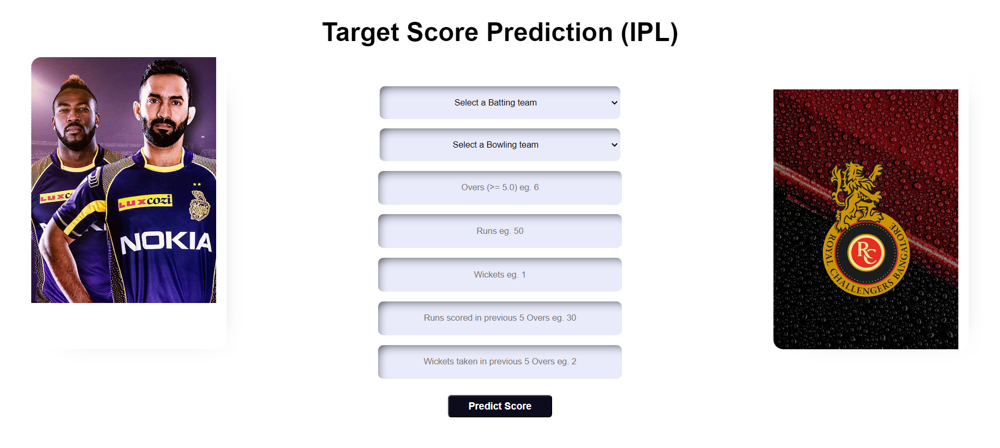

# IPL Score Prediction

 

• This repository consists of **Machine Learning Model** used to predict the score of first innings of an IPL match and is created with **_Flask_**

### 🔵 Creating the flask API

```
app = Flask("__name__")
```

The Home method calls our index.html.

```
@app.route('/',methods=['GET'])
def Home():
    return render_template('index.html')
```

The predict method is our POST method, which is basically called when we pass all the inputs from our front end and click Predict.

```
@app.route("/predict", methods=['POST'])
def predict():
```

The run() method of Flask class runs the application on the local development server.

```
app.run(debug=True)
```

Our model is ready, now lets test.

Go to Anaconda Prompt, and run the below query.

```
python app.py
```

Below message in Python shell is seen, which indicates that our App is now hosted at http://127.0.0.1:5000/ or localhost:5000

```
* Running on http://127.0.0.1:5000/ (Press CTRL+C to quit)
```

• A glimpse of the web app:


